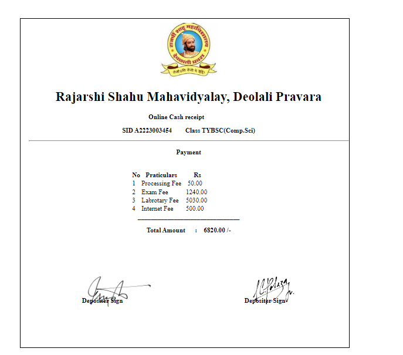

# # Payment Receipt

## Description :

A payment receipt is a document given to a customer as proof of full or partial payment for a product or service. Start invoicing for free. A payment receipt is also referred to as a ***"'receipt for payment'""***. It's created after payment has been entered on a given sale. it a   **'collage payment reciept'.**

## Layout:

SS

## contribute

Made with [contrib.rocks](https://contrib.rocks).
